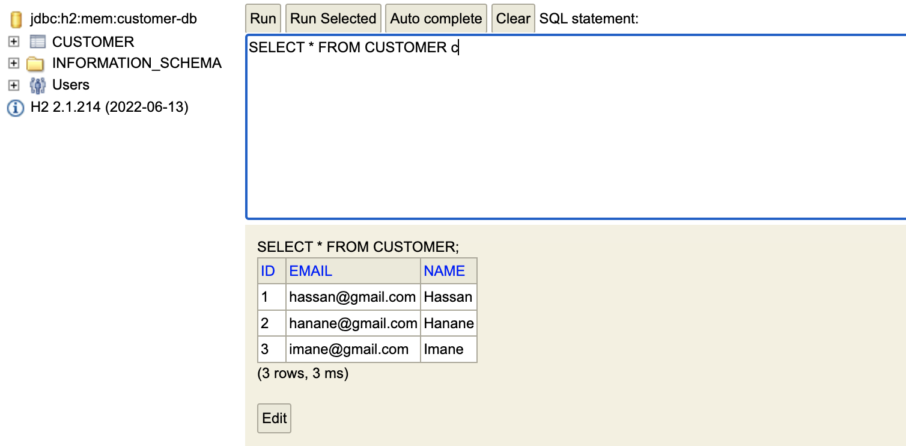

# SOA Ecommerce App With Spring Cloud Web Services

### Base de données customer-db du service customer

### liste des clients

### projection sur les clients

### état de l'actuator dans le service client
