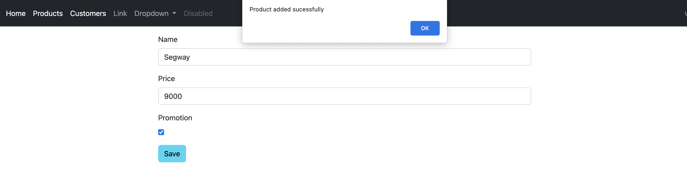

# SOA Ecommerce App With Spring Cloud Web Services

### Base de données customers-db du service customer

### liste des clients

### projection sur les clients

### état de l'actuator dans le service client

### Base de données products-db du service inventory

### inventaire des produits

### état de l'actuator dans le service inventaire

### liste des clients à partir de la passerelle

### inventaire des produits à partir de la passerelle

### Eureka ui

### liste de clients par la route dynamique

### inventaire de produits par la route dynamique

### facture id=1 du service facturation

### route dynamique du service facturation

### facture id=1 du service facturation par la route dynamique

### Interface de manipulation des produits basé sur le client front-end Angular 2 avec de fausses données

### Interface de connexion

### nom utilisateur et déconnexion

### création de produit

### mise à jour de produit

